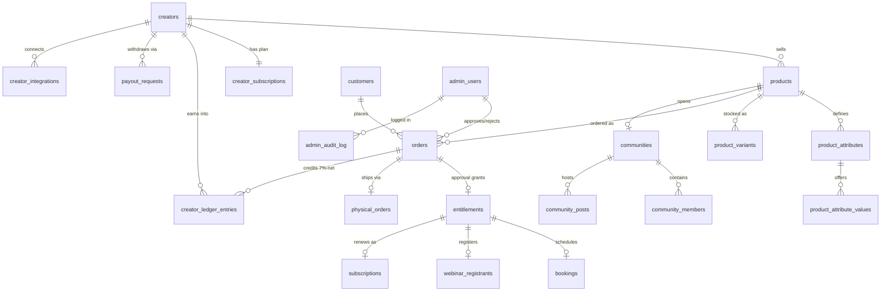

# MUYA — Database Structure

*Reflects the live schema on Supabase project "Muya Project" as of Phase 2 (2026-08-09). Source of truth: `/supabase/migrations`.*

The database is organized in seven groups. Every table has row-level security enabled with **zero public policies** — the browser-facing API key can read/write nothing; all access goes through MUYA's server code, which checks permissions first.

---

## 1. People (who uses MUYA)

**`creators`** — one row per creator/store owner.
Key columns: `email` (unique — their passwordless identity), `store_slug` (unique — their storefront URL, e.g. `/chef-sara`), `display_name`, `bio`, `profile_image_url`, `social_links` (JSON), `theme` (JSON — storefront design choices), `currency` (default ETB), `preferred_locale` (their dashboard language), `status` (`active`/`suspended`).

**`customers`** — one row per buyer, created automatically at first order.
Key columns: `email` (unique — their passwordless identity), `name`, `preferred_locale` (used for emails).

**`admin_users`** — MUYA's own team. Completely separate from creators/customers.
Key columns: `email`, `role` (`superadmin` / `finance` / `support` / `trust_safety` — controls which admin screens they can use), `auth_user_id` (links to the password+MFA login), `mfa_enabled`.

**`admin_audit_log`** — permanent record of every consequential admin action.
Key columns: `admin_user_id` (who), `action` (what, e.g. `approve_order`, `suspend_creator`), `target_type` + `target_id` (on what), `notes`, `created_at` (when).

## 2. Plans & platform configuration

**`creator_subscriptions`** — each creator's tier: `tier` (`free` / `premium_growth` / `premium_business`), `status`, `current_period_end`. Every creator is on `free` today.

**`platform_settings`** — key/value JSON configuration. Currently holds `tier_config` set to **all-features-free mode**; activating the real three-tier gating later means editing this one row (covered by the post-launch tier guide).

## 3. Products (what creators sell)

**`products`** — every sellable item, all ten types in one table.
Key columns: `creator_id`, `type` (one of `digital_download`, `course`, `coaching_call`, `webinar`, `membership`, `lead_magnet`, `custom_product`, `external_link`, `community`, `physical`), `title`, `description`, `price`, `currency`, `is_recurring` + `billing_interval` (memberships), `config` (JSON — type-specific settings like course modules, webinar date, booking duration), `status` (`active`/`draft`/`archived`), `sort_order` (position on the storefront).

**`product_attributes`** — for physical products: creator-defined option names (e.g. "Color", "Size", "Material"). Any attribute, not a fixed list.

**`product_attribute_values`** — the choices for each attribute (e.g. Color → "Red", "Blue").

**`product_variants`** — one row per sellable combination (e.g. Red / L): `sku`, `attribute_values` (JSON like `{"Color":"Red","Size":"L"}`), `price_override` (empty = use the product price), `stock_count` (inventory, decremented on approved orders), `weight_grams`, `image_url`.

## 4. Orders & money

**`orders`** — the heart of the system; one row per purchase.
Key columns: `creator_id`, `customer_id`, `product_id`, `variant_id`, `quantity`, `item_amount` (creator's price), `shipping_fee`, `total_charged`, `commission_amount` (MUYA's 7%, computed at approval), `creator_net_amount` (what the creator earns), `payment_status` (`pending` → `paid` on approve, or `rejected`; `refunded` supported), **`approved_by` / `approved_at` / `rejection_reason`** (the order-request model — which admin decided, when, and why if rejected), `chapa_tx_ref` (reserved for the future Chapa integration).

**`entitlements`** — the single source of truth for access: "this customer may open this product." Created on approval. Key columns: `customer_id`, `product_id`, `order_id`, `status` (`active`/`canceled`/`expired`), `revoked_at`. Every course view, download, or community entry checks this table live.

**`subscriptions`** — recurring customer purchases (memberships/communities): links to an entitlement, `status`, `current_period_end`.

**`creator_ledger_entries`** — the money ledger, append-only. Every event writes a row: `entry_type` (`sale` credit / `payout` debit / `refund` debit / `adjustment`), `amount`, and `balance_after` (running balance). A creator's income tab is computed entirely from this table, and it must always reconcile against orders and payouts.

**`payout_requests`** — creators asking to withdraw their balance: `amount`, `payout_method` (`bank`/`telebirr`), `payout_details` (JSON account info), `status` (`pending` → `processing` → `paid`, or `rejected`), `processed_by` (admin).

## 5. Deliveries per product type

**`bookings`** — coaching-call appointments: `scheduled_at`, `duration_minutes`, `calendar_event_id` (Google Calendar), `meeting_link` (Google Meet), `status`.

**`webinar_registrants`** — one row per webinar signup with their personal `join_url` (Zoom).

**`physical_orders`** — shipping companion to a physical-product order: `shipping_name/phone/address/city/notes`, `payment_method` (`order_request` now; `chapa`/`cash_on_delivery` ready for later), `shipment_status` (`pending` → `shipped` → `delivered`), `tracking_number`.

## 6. Communities & engagement

**`communities`** — one per community product: `name`, `description`, `frozen` (admin can freeze without deleting).

**`community_members`** — who's inside: `community_id` + `customer_id` (unique together), `role` (`member`/`moderator`/`admin`).

**`community_posts`** — the feed: `body`, `image_url`, plus moderation fields (`reported`, `report_reason`, `removed`).

**`affiliates`** / **`affiliate_referrals`** — a creator's affiliate partners (`referral_code`, `commission_percent`) and the commissions each referred order earned (`payout_status`).

## 7. System plumbing

**`magic_link_tokens`** — passwordless sign-in: stores only the SHA-256 **hash** of each emailed token, `owner_type` (`customer`/`creator`), `expires_at` (15–30 min), `used_at` (single-use).

**`creator_integrations`** — each creator's connected Google Calendar (and optionally Zoom) OAuth tokens: `provider`, `access_token`, `refresh_token`, `token_expires_at`.

**`failed_jobs`** — dead-letter queue for background work (email sends, fulfillment steps) that failed: `job_type`, `payload` (JSON — enough to replay it), `attempts`, `next_retry_at`, `status` (`retrying`/`dead`/`resolved`). Visible to admins so nothing fails silently.

---

## How the tables connect (main flow)

**The order lifecycle in one line:** customer places order (`orders.pending`) → admin approves (`paid`, `approved_by` set, audit-logged) → 7% commission computed → `creator_ledger_entries` credited → `entitlement` created → product-type delivery (booking / registrant / physical order / download access) → emails to customer + creator.

**Totals: 26 tables · 16 indexes · RLS on 26/26 · seeded with 1 superadmin, tier config, 1 demo creator + product.**
